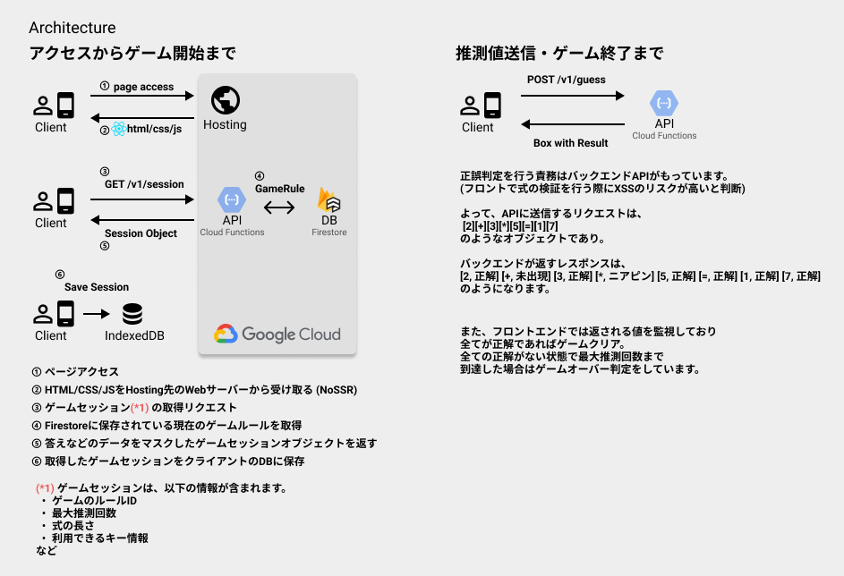

# Nerdle

このリポジトリは[Nerdle](https://nerdlegame.com/)のクローンアプリを React/Express/Firebase で作成したリポジトリです。

- [Nerdle](#nerdle)
  - [Demo Site](#demo-site)
  - [環境構築](#環境構築)
    - [**NodeJS**](#nodejs)
    - [**Visual Studio Code**](#visual-studio-code)
  - [Getting Started : Build on your own machine](#getting-started--build-on-your-own-machine)
    - [Firebase Emulator のセットアップ](#firebase-emulator-のセットアップ)
    - [install dependencies](#install-dependencies)
    - [Backend API の起動 (Firebase Emulator functions/firestore)](#backend-api-の起動-firebase-emulator-functionsfirestore)
    - [初期データの投入](#初期データの投入)
    - [Frontend App の設定 / 起動](#frontend-app-の設定--起動)
    - [Getting Started 　: Tips](#getting-started--tips)
  - [Firebase へのデプロイ](#firebase-へのデプロイ)
  - [その他、補足事項](#その他補足事項)
    - [このプロジェクトのフォルダ構成](#このプロジェクトのフォルダ構成)
    - [アーキテクチャ](#アーキテクチャ)
    - [将来的に実装したいアーキテクチャ/設計](#将来的に実装したいアーキテクチャ設計)

## Demo Site

[Nerdle](https://yokoyama-nerdle.web.app/)

## 環境構築

### **NodeJS**

NodeJS は `.node-version` に記載のバージョンを利用してください。  
`fnm`など`.node-version`に対応している NodeJS のバージョン管理ツールの利用をオススメします。

- [fnm](https://github.com/Schniz/fnm) (Win/macOS)
- [n](https://github.com/tj/n) (macOS)
- [asdf](https://asdf-vm.com/) (macOS)
- [nodenv](https://github.com/nodenv/nodenv) (macOS)
- [nvs](https://github.com/jasongin/nvs) (Win/macOS)

### **Visual Studio Code**

[Visual Studio Code](https://azure.microsoft.com/ja-jp/products/visual-studio-code/) の利用を推奨しています。  
静的解析、デバッグ機能などが利用できるよう設定が記載済みです。  
本プロジェクトを開いた際に、推奨される拡張機能が表示されると思うので指示に従ってインストールしてください。

## Getting Started : Build on your own machine

### Firebase Emulator のセットアップ

- [Firebase CLI のインストール](https://firebase.google.com/docs/cli?hl=ja) (`npm install -g firebase-tools`)
- [Firebase Emulator Suite の構成](https://firebase.google.com/docs/emulator-suite/install_and_configure?hl=ja)

### install dependencies

```bash
// npm workspaces 機能を利用しているため、フロントエンド・API 個別に行う必要はありません
npm ci
```

### Backend API の起動 (Firebase Emulator functions/firestore)

※ Firebase 関連の設定が必要になる場合は `.firebaserc` などの設定を設定してください

```bash
npm run dev -w functions
// View in Emulator Functions : http://127.0.0.1:4000/functions
// View in Emulator Firestore : http://127.0.0.1:4000/firestore
```

### 初期データの投入

初期の問題データ([sampleData](https://github.com/DaishoYokoyama/nerdle/blob/main/packages/functions/sampleData/rule.json))を curl コマンドや POSTMAN を利用して登録します

```bash
curl -X POST \
     -H "Content-Type: application/json" \
     -d @./docs/sampleData/rule.json \
     http://127.0.0.1:5001/{YOUR_APP_NAME}/asia-northeast1/api/v1/rules

```

Path や URL は適宜自身の環境で変更が必要です

### Frontend App の設定 / 起動

`./packages/web/.env.local.example` をコピーして、`.env.local` を作成します。

その後、内部の API のエンドポイント指定を先ほど立ち上げた API の URL に書き換えてください。

e.g

```json
VITE_API_BASE_URL=http://127.0.0.1:5001/nerdle/asia-northeast1/api
```

上記設定を完了後、フロントエンドのアプリを立ち上げます

```bash
npm run dev -w web
// Access to (http://127.0.0.1:5173/)
```

### Getting Started 　: Tips

- 開発時にブレークポイントなどを設定して動作を確認したい時は、vscode の `実行とデバッグ` 機能を利用することができます。起動オプションなどの詳細は [.vscode/launch.json](https://github.com/DaishoYokoyama/nerdle/blob/main/.vscode/launch.json) を確認してください。

## Firebase へのデプロイ

自身の Firebase にデプロイする際は下記の方法で実施してください。

1. Firebase のプロジェクト作成
2. Firebase CLI でログイン & 1 で作成したプロジェクトをワークスペースと関連付けする
3. .firebaserc の設定プロジェクト名を変更
4. プロジェクトのビルド (`npm run build` で Web/API 両プロジェクトビルドされます)
5. `firebase deploy` コマンドを実行

注意点として、Firebase CloudFunctions を利用しているため無料プランでは WebAPI をデプロイすることができません。

## その他、補足事項

### このプロジェクトのフォルダ構成

このプロジェクトは `packages/web` と `packages/frontend` で構成される monorepo です。

プロジェクトルートで、firebase の構成と eslint のルールを管理しています。

- `packages/web` は Typescript + React + Vite で構成された SPA
- `packages/functions` は Typescript + Express で構成された API

```text
.
├── README.md
├── firebase.json
├── firestore.indexes.json
├── firestore.rules
├── package-lock.json
├── package.json
├── packages
│   ├── functions   // API
│   └── web         // WebApp
└── sampleData
    ├── guess.json
    └── rule.json

```

### アーキテクチャ



### 将来的に実装したいアーキテクチャ/設計

- 共通
  - セッション管理方法の再検討
    - バックエンド側でセッション管理ができないためサーバー側で管理するかライフサイクルを設計する必要がある
  - フロントエンド/バックエンド間の型定義を共通化
    - バックエンド: OpenAPI 形式の定義ファイルを公開する
    - フロントエンド: OpenAPI 定義から[HTTPClient を自動生成する](https://github.com/OpenAPITools/openapi-generator)
  - CI/CD
  - 管理者用のツール作成
- フロントエンド (packages/web)
  - Storybook / Jest の導入と単体試験
  - `Nerdle.hook.tsx` の分離とリファクタリング
    - 振る舞いを全て管理しているが、関心ごとに応じて分離すべき
    - パフォーマンスに懸念点があるので解消する
- バックエンド (packages/functions)
  - DI Container の導入
  - バリデーション
  - ID 発行サービスの作成
  - モデルの再設計
    - e.g) 式を入力する箱をバックエンド側で全て生成する必要はなく、無駄に通信量がかかっている
